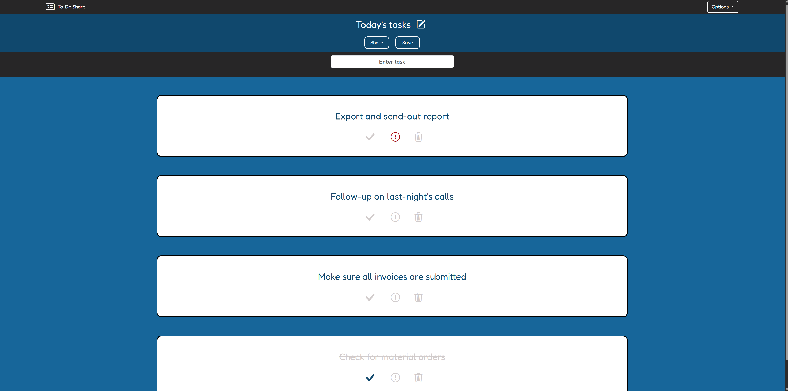

# To-Do Share

A basic little to-do list web app I made for a course project. It's a simple app that lets users create an account, generate lists, save and edit them. It also lets you rearrange non-important
and unfinished tasks via drag and drop, and users can share their lists by providing the link displayed via the "Share" button. Users can paste the link in their own browser, be taken to the edit 
page for that list and choose to save it themselves. Shared lists are a single object, so different users making edits will show for anyone with a saved relationship to that list. 

 

### Mobile/Small Screen Example:

## How It's Made:

Tech used: HTML, CSS, Python, Flask/Bootstrap, SQLAlchemy, wtforms, werkzeug (password hashing and checking)

The application is a web-based to-do app that runs on 4 ORM tables. One stores user/password data, the other stores list names, the third stores tasks and links them via a one-to-many relationship to their 
parent list-name, and the last table is used to create a many-to-many relationship between users and list-names (this is how sharing works).

All routing is handled by Flask, styling is a combination of Bootstrap and CSS. 

## To use:

Beyond copying the files and installing the "requirements.txt" file, flask_bootstrap can be a little peculiar. Trying to download this via PyCharm kept failing, requiring the user to instead install "Bootstrap-Flask" 
in their terminal to get flask_bootstrap to run properly. The user will also need to set a "FLASK_KEY" environmental variable for the program to run, as it's what flask will pull and use as the Secret Key for CSRF 
protection.

## Lessons Learned:

This was a project from an online course which builds upon our learned web-development skills. We were required to make a To-Do web app without guidance. I decided to use the packages and frameworks I was familiar with.

The biggest challenges for me here was getting comfortable setting-up and managing my ORM tables. Getting them to properly take and receive new and edited data was a great exercise and I look forward to learning more
about databases and management. One of the other issues I ran into were limitations due to Python/Flask/Bootstrap. I found certain things like drag and drop were not possible with Bootstrap or the things I was using, so
I had to research and use some JS code (I'm starting to learn JS at the time of writing this, so I hope to be able to code it all on my own soon!) to get this to work, consulting with an AI to help me understand what things
were doing. 

In the end, it all came together and I'm happy with the final result. There is plenty of room for improvement on it and I look forward to revisiting this someday with more expertise.